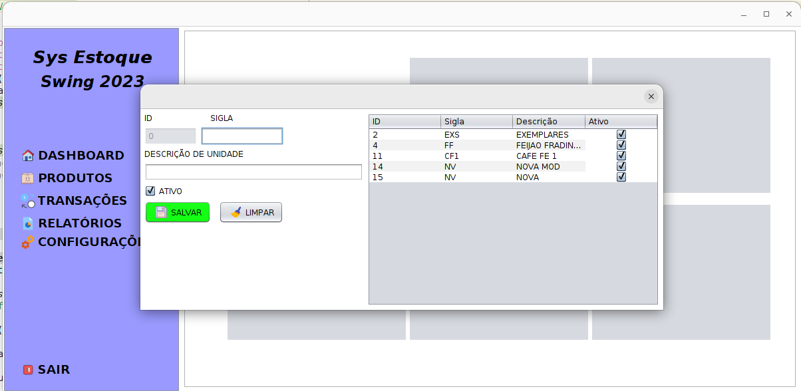

# Sistema de Estoque em Swing - Versão 2023

## Descrição

O Sistema de Estoque em Swing é uma aplicação de desktop desenvolvida em Java Swing que permite o controle de estoque de produtos, registros de notas de entrada e saída, rastreamento de produtos e geração de relatórios. Este sistema oferece funcionalidades abrangentes para gerenciar produtos, transações, configurações e relatórios relacionados ao estoque.

## Funcionalidades Principais

### Tela Principal

A tela principal é o ponto de entrada do sistema e fornece acesso rápido às principais funcionalidades, incluindo Produtos, Unidades, NCM (Nomenclatura Comum do Mercosul), CFOP (Código Fiscal de Operações e Prestações) e outras opções.

### Produtos

- Cadastro e gerenciamento de produtos.
- Informações detalhadas sobre cada produto, como nome, unidade, NCM e valor.
- Rastreamento de entradas e saídas de produtos.

### Unidade

- Cadastro de unidades de medida para produtos.
- Associação de unidades aos produtos.

### NCM (Nomenclatura Comum do Mercosul)

- Cadastro de códigos NCM para classificação de produtos.
- Associação de códigos NCM aos produtos.

### CFOP (Código Fiscal de Operações e Prestações)

- Cadastro de códigos CFOP para operações fiscais.
- Registro de CFOP em transações.

### Transações

- Registro de notas de entrada e saída.
- Associação de produtos, CFOP, unidades e outras informações nas transações.
- Rastreamento de datas, quantidades e detalhes das transações.

### Relatórios

- Geração de relatórios de estoque, transações e produtos.
- Informações resumidas e detalhadas disponíveis.

### Configuração

- Configurações gerais do sistema.
- Configuração do banco de dados PostgreSQL, preferências do usuário e outras opções.

## Pré-requisitos

- Java 1.8 (JRE) instalado.
- Banco de dados PostgreSQL configurado.

## Como Executar

1. Clone o repositório.
2. Compile e execute o sistema Java Swing.

```bash
javac SistemaEstoque.java
java SistemaEstoque
```

## **Configuração do Banco de Dados**

Certifique-se de configurar o banco de dados PostgreSQL com as credenciais apropriadas no arquivo de configuração do sistema.

## **Contribuição**

Contribuições para melhorias, correções de bugs e novas funcionalidades são bem-vindas. Sinta-se à vontade para criar "pull requests" ou relatar problemas.

## **Autores**

- Edson Sousa

## Regras de negócio

### **Regra de Negócio: Gerenciamento de Unidades**

- **Descrição**: O módulo de gerenciamento de unidades permite que os usuários cadastrem, editem e consultem unidades de medida. Cada unidade é identificada por sua sigla e descrição, e pode ser marcada como ativa ou inativa.
- **Cadastro de Unidades**:
    - Os usuários têm a capacidade de cadastrar novas unidades no sistema.
    - Cada unidade deve ter uma sigla única, que é uma abreviação da unidade de medida (por exemplo, "Kg" para quilogramas).
    - Uma descrição pode ser fornecida para explicar a unidade em mais detalhes (por exemplo, "Quilogramas").
    - Uma opção de ativação/desativação está disponível para cada unidade.
    - Unidades inativas não podem ser selecionadas em outros lugares do sistema.
- **Edição de Unidades**:
    - Os usuários têm a capacidade de editar informações de unidades existentes.
    - A sigla e a descrição da unidade podem ser atualizadas.
    - A opção de ativação/desativação pode ser alterada.
- **Consulta de Unidades**:
    - Os usuários podem consultar a lista de todas as unidades cadastradas.
    - As unidades podem ser filtradas por estado (ativas, inativas ou ambas).
    - É possível visualizar detalhes de cada unidade, incluindo sua sigla, descrição e status de ativação.
- **Validações**:
    - O sistema deve garantir que a sigla de cada unidade seja única, evitando duplicações.
    - Unidades inativas não podem ser excluídas, mas podem ser desativadas.
- **Resultado Esperado**: O módulo de gerenciamento de unidades permite manter um catálogo organizado de unidades de medida, garantindo que apenas unidades ativas e únicas sejam usadas em outras partes do sistema, como na definição de produtos.

> Esta regra de negócio descreve como o sistema deve lidar com o gerenciamento de unidades, incluindo adição, edição, consulta, validações e ativação/desativação. Ela ajuda a garantir a consistência e a integridade das informações de unidades no sistema.
> 

### **Regra de Negócio: Gerenciamento de NCM**

- **Descrição**: O módulo de gerenciamento de NCM permite que os usuários cadastrem, editem e consultem códigos NCM. Cada código NCM é identificado por seu código e descrição, e pode ser marcado como ativo ou inativo.
- **Cadastro de Códigos NCM**:
    - Os usuários têm a capacidade de cadastrar novos códigos NCM no sistema.
    - Cada código NCM deve ser único e corresponder a uma classificação fiscal de produtos.
    - Uma descrição pode ser fornecida para explicar o código NCM em mais detalhes.
    - Uma opção de ativação/desativação está disponível para cada código NCM.
    - Códigos NCM inativos não podem ser selecionados em outros lugares do sistema.
- **Edição de Códigos NCM**:
    - Os usuários têm a capacidade de editar informações de códigos NCM existentes.
    - O código NCM e a descrição podem ser atualizados.
    - A opção de ativação/desativação pode ser alterada.
- **Consulta de Códigos NCM**:
    - Os usuários podem consultar a lista de todos os códigos NCM cadastrados.
    - Os códigos NCM podem ser filtrados por estado (ativos, inativos ou ambas).
    - É possível visualizar detalhes de cada código NCM, incluindo seu código, descrição e status de ativação.
- **Validações**:
    - O sistema deve garantir que os códigos NCM sejam únicos, evitando duplicações.
    - Códigos NCM inativos não podem ser excluídos, mas podem ser desativados.
- **Resultado Esperado**: O módulo de gerenciamento de NCM permite manter um catálogo organizado de códigos NCM, garantindo que apenas códigos NCM ativos e únicos sejam usados em outras partes do sistema, como na classificação fiscal de produtos.

> Esta regra de negócio descreve como o sistema deve lidar com o gerenciamento de códigos NCM, incluindo adição, edição, consulta, validações e ativação/desativação. Ela ajuda a garantir a consistência e a integridade das informações de códigos NCM no sistema.
>

### Regra de Negócio: Gerenciamento de Produtos

Descrição: O módulo de gerenciamento de produtos permite aos usuários cadastrar, editar, consultar e remover produtos no sistema. Cada produto é caracterizado por sua descrição, código NCM, unidade de medida, observações e status de ativação.

**Cadastro de Produtos:**

1. Os usuários têm a capacidade de adicionar novos produtos ao sistema.
2. Cada produto deve ter uma descrição única que o identifica claramente.
3. Os códigos NCM disponíveis no sistema estão disponíveis para seleção e vinculação a produtos.
4. A unidade de medida do produto também pode ser selecionada entre as opções disponíveis no sistema.
5. Observações adicionais podem ser registradas para fornecer informações detalhadas sobre o produto.
6. Cada produto tem um status de ativação, indicando se ele está ativo ou inativo.
7. Produtos inativos não devem estar disponíveis para seleção em outros módulos do sistema.

**Edição de Produtos:**

1. Os usuários podem editar informações de produtos existentes.
2. A descrição, código NCM, unidade de medida, observações e status de ativação podem ser atualizados.
3. Ao editar um produto, o sistema deve garantir que a descrição permaneça única.

**Consulta de Produtos:**

1. Os usuários podem consultar a lista de todos os produtos cadastrados.
2. Os produtos podem ser filtrados por estado (ativos, inativos ou ambos).
3. Detalhes completos de cada produto, incluindo descrição, código NCM, unidade de medida, observações e status de ativação, devem ser visíveis.

**Exclusão de Produtos:**

1. A exclusão de produtos não é realizada fisicamente; em vez disso, um campo "deletado" é marcado como verdadeiro no banco de dados, indicando que o produto não está mais disponível.
2. Produtos marcados como deletados não devem aparecer em consultas ou seleções em outros módulos do sistema.

**Validações:**

1. O sistema deve garantir que a descrição do produto seja única entre os produtos ativos.
2. Ao cadastrar ou editar um produto, o sistema deve garantir que todos os campos obrigatórios estejam preenchidos (descrição, código NCM, unidade de medida).
3. O sistema deve permitir a vinculação apenas a códigos NCM e unidades de medida válidos.
4. Produtos inativos não podem ser excluídos, mas podem ser desativados.

**Resultado Esperado:**

 O módulo de gerenciamento de produtos permite manter um catálogo organizado de produtos com informações detalhadas, garantindo que produtos ativos estejam disponíveis para seleção em outros módulos do sistema. Produtos inativos são mantidos no banco de dados, mas não afetam o funcionamento do sistema.
## Regra de Negócio: Gerenciamento de Transações

Descrição: O módulo de gerenciamento de transações permite aos usuários registrar e gerenciar transações, sejam de entrada ou saída no sistema. Cada transação é caracterizada pelo seu tipo, CFOP, cliente associado, número da nota fiscal (se aplicável), chave de identificação, data, hora e informações complementares.

### Cadastro de Transações:

Os usuários têm a capacidade de registrar novas transações no sistema.
Cada transação deve ser associada a um cliente existente e a um CFOP válido.
Os tipos de transação são de entrada ou saída e devem ser definidos para cada transação.
Informações adicionais, como o número da nota fiscal e chave de identificação, podem ser registradas, quando apropriado.
Detalhes da data e hora da transação são capturados automaticamente no momento do registro.

### Edição de Transações:

Os usuários podem editar informações de transações existentes.
Informações detalhadas da transação, como tipo, CFOP, cliente associado, número da nota fiscal, chave de identificação e informações complementares, podem ser atualizadas.

### Consulta de Transações:

Os usuários podem visualizar uma lista de todas as transações registradas no sistema.
As transações podem ser filtradas por tipo (entrada, saída) e data.
Detalhes completos de cada transação, incluindo tipo, CFOP, cliente, número da nota fiscal, chave de identificação, data e hora, e informações complementares, devem ser acessíveis.

### Exclusão de Transações:

A exclusão de transações não é realizada fisicamente; um campo "deletado" é marcado como verdadeiro no banco de dados para indicar que a transação não está mais ativa.
Transações marcadas como deletadas não devem aparecer em consultas ou seleções em outros módulos do sistema.

### Validações:

O sistema deve garantir que as transações estejam vinculadas a clientes válidos e CFOPs existentes.
Ao registrar ou editar uma transação, o sistema deve garantir que todos os campos obrigatórios estejam preenchidos.
Transações marcadas como deletadas não devem ser excluídas, mas podem ser desativadas.

### Resultado Esperado:

O módulo de gerenciamento de transações permite um registro eficaz das movimentações de entrada e saída, fornecendo um histórico detalhado das operações. As transações ativas estão disponíveis para consulta e são mantidas para referência, enquanto as transações marcadas como deletadas não influenciam as operações do sistema.
Claro, abaixo está um exemplo de regra de negócio para o gerenciamento de clientes:

---

**Regra de Negócio: Gerenciamento de Clientes**

**Cadastro de Clientes:**

1. **Adicionar Clientes:**
   - Os usuários têm permissão para adicionar novos clientes ao sistema.
   - Cada cliente deve ter um CNPJ válido que o identifique unicamente.
   - São registradas informações como Razão Social, Nome Fantasia, Inscrição Estadual e Municipal, Endereço, Contato, Responsável Legal, e Tipo de Empresa ao criar um novo cliente.
   - A obrigatoriedade de campos varia, mas o CNPJ, Razão Social e Endereço são normalmente obrigatórios.

2. **Edição de Clientes:**
   - Usuários podem editar informações de clientes existentes.
   - Qualquer alteração feita deve manter o CNPJ como identificador único.
   - Informações como Razão Social, Nome Fantasia, Inscrição Estadual e Municipal, Endereço, Contato, Responsável Legal e Tipo de Empresa podem ser atualizadas.

**Consulta de Clientes:**

1. **Lista de Clientes:**
   - Os usuários têm a capacidade de visualizar todos os clientes cadastrados.
   - Pode ser feito um filtro por status (ativos, inativos ou ambos).
   - Os detalhes completos de cada cliente, incluindo todos os campos registrados, devem ser visíveis.
   
2. **Detalhes do Cliente:**
   - Ao selecionar um cliente, o sistema deve fornecer todas as informações detalhadas relacionadas a esse cliente.

**Exclusão de Clientes:**

1. **Desativação de Clientes:**
   - A exclusão de clientes não é realizada fisicamente; ao invés disso, um campo "deletado" é marcado como verdadeiro no banco de dados, indicando que o cliente não está mais disponível.
   - Clientes marcados como deletados não devem ser mostrados em consultas ou seleções em outros módulos do sistema.

**Validações:**

1. **Campos Obrigatórios:**
   - O sistema deve garantir que campos obrigatórios estejam preenchidos ao adicionar ou editar um cliente, como CNPJ, Razão Social e Endereço.
   - A obrigatoriedade de outros campos pode variar com base nas políticas e regulamentações.

2. **Verificação de CNPJ:**
   - Ao adicionar ou editar um cliente, o sistema deve verificar se o CNPJ fornecido é válido e único.

**Resultado Esperado:**

O módulo de gerenciamento de clientes permite a manutenção de um cadastro organizado e detalhado de clientes, garantindo que informações cruciais estejam sempre disponíveis e atualizadas para consulta e manipulação no sistema.

---

Essa regra de negócio fornece uma visão geral das operações permitidas e das restrições associadas ao gerenciamento de clientes em um sistema, garantindo a integridade dos dados e a usabilidade do módulo de clientes.


## Imagens


